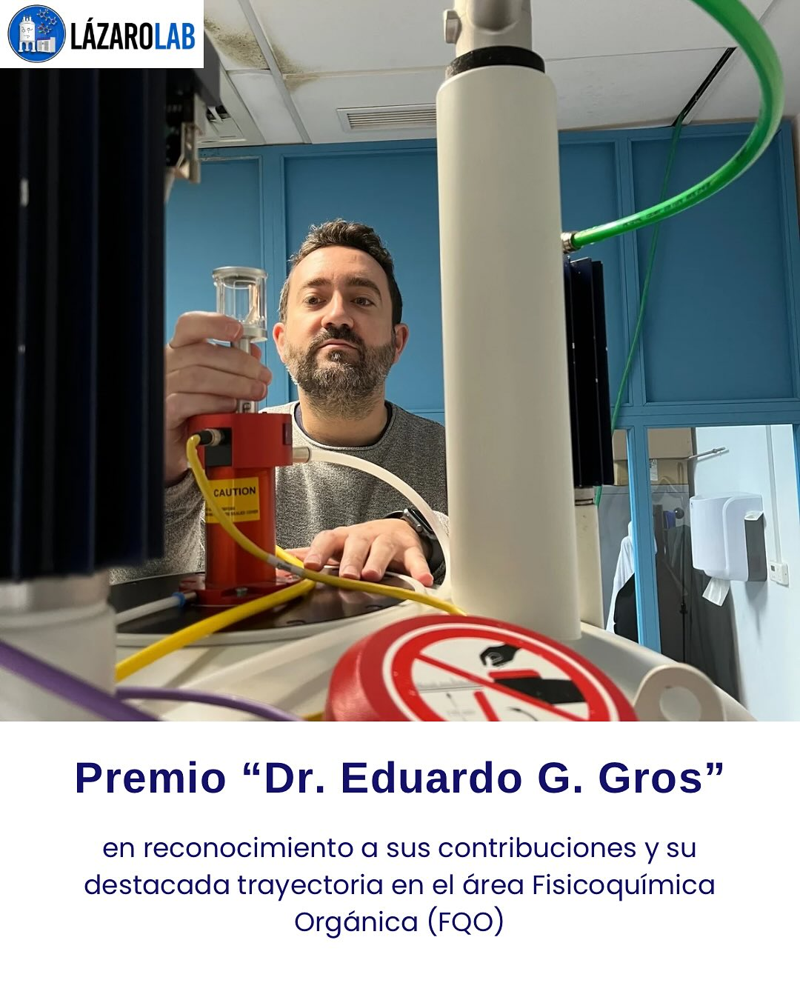

Con enorme alegria compartimos que [Juan Manuel Lazaro Martinez](/author/jmlazaro/), director de GINaPs, recibio el Premio "Dr. Eduardo G. Gros", un reconocimiento otorgado por la Sociedad Argentina de Investigaciones en Quimica Organica (SAIQO) a investigadores jovenes destacados en el area de Fisicoquimica Organica.

<!--more-->

La distincion reconoce sus contribuciones cientificas y su trayectoria en un campo en el que ha realizado aportes relevantes, especialmente en Quimica de Materiales y en el uso de tecnicas espectroscopicas avanzadas, con un enfasis particular en la resonancia magnetica nuclear de solidos.

Actualmente, el Dr. Lazaro Martinez se desempena como Profesor Asociado de la Catedra de Quimica Organica 2 de la Facultad de Farmacia y Bioquimica de la Universidad de Buenos Aires, y tambien como Investigador Independiente del CONICET en el Instituto de Quimica y Metabolismo del Farmaco (IQUIMEFA).

Como parte de este reconocimiento, ofrecera una conferencia plenaria en el XXV Simposio Nacional de Quimica Organica (SINAQO), que se llevara a cabo en la ciudad de Mar del Plata entre el 29 de octubre y el 1 de noviembre de 2025.

Desde GINaPs celebramos este logro con muchisimo orgullo. Este reconocimiento pone en valor una trayectoria construida con compromiso, excelencia academica y una dedicacion sostenida a la investigacion y a la formacion de recursos humanos.

Para conocer la publicacion original, pueden visitar el post de Instagram de LazaroLab:

[https://www.instagram.com/lazarolabffyb/p/DP2JWQAEtdG/](https://www.instagram.com/lazarolabffyb/p/DP2JWQAEtdG/)
